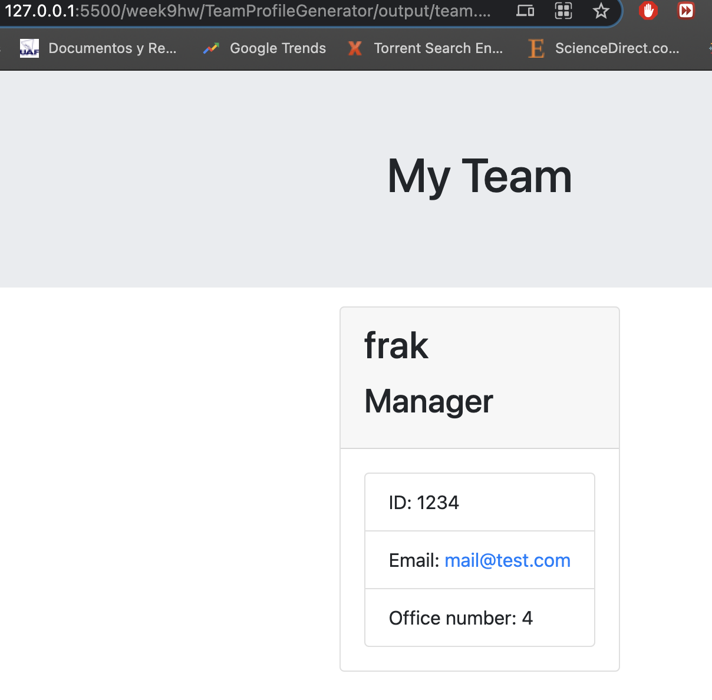

# TeamProfileGenerator
### by Frank Ortega

## This tool is designed to help create a simple team through CLI.

###### Made for Bootcamp UM 2021
### Description
* Node.js command-line application for quick way to add team members with certain params. and generate HTML document

## ScreenShot

Please run npm i from project folder and run in live server from VS code. 

## License
MIT

#### Tools Used
* 
* 
* 
* 
__________________________________________________________

## Demo click to open youtube.

https://youtu.be/Dz0RasG51Yo

## Help and reports
Please report issues to fortega328@github.com

TABLE OF CONTENTS 
__________________________________________________________
* [Description](#description)
* [Tools Used](#tools-used)
* [Contact Me](#contact-Me)
* [Demo](#demo)
